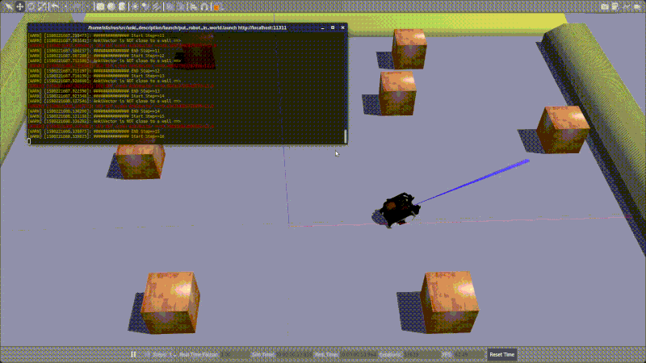

# vector_ros_openai
_OpenAI Gym for Anki Vector simulated in Gazebo_

This package is based on a modified version of [openai_ros](http://wiki.ros.org/openai_ros). It's purpose is to provide a single entry point to start reinforcement learning with Anki Vector utilizing [OpenAI Gym](https://gym.openai.com/) and [anki_description](https://github.com/nilseuropa/anki_description).




## Jump start
* Change `ros_ws_abspath` in `config/vector_openai_qlearn_params.yaml` to your own path
* `roslaunch vector_ros_openai start_training.launch` _( downloads the model automatically )_

## Contents
The following four layers provide the connection between the learning algorithm and the simulation in a top down order.

#### Training scripts
The **scripts** folder contains the learning algorithm setup that is independent of the robot and task environments that are also selected here. For example to experiment with learning algorithms for the collision avoidance task just add a new script here.

To start the whole chain of environments just invoke:
```python
task_and_robot_environment_name = rospy.get_param('/anki_vector/task_and_robot_environment_name')
env = StartOpenAI_ROS_Environment(task_and_robot_environment_name)
```
Configuration files for the training are stored under `/vector_ros_openai/config` .

* Example [Q-Learning](https://github.com/vmayoral/basic_reinforcement_learning) by Victor Mayoral

#### Task Environments
Under `src/vector_ros_openai/task_envs/anki_vector` you can find the **task** or **world** scripts that describe the interface between the robot environment and the training script. Depending on the task that has to be learned by the agent the following functions are relevant _( see openai_ros tutorials for details )_:
* How to apply the selected action to the robot: **_set_action**
* How to get the observations resulting from the action: **_get_obs**
* How to compute the reward: **_compute_reward**
* Detect if the training for current episode has finished: **_is_done**

Configuration files for the environments are stored under `/task_envs/anki_vector/config` .

#### Robot Environment
The AnkiVectorEnv superclass implements methods to interface the sensors and actuators of the [simulation](https://github.com/nilseuropa/anki_description) with the task environment:

`src/vector_ros_openai/robot_envs/anki_vector_env.py` :
* **move_base** - move the base based on the linear and angular speeds given
* **wait_until_twist_achieved** - wait to achieve speeds based on odometry _( not used )_
* **get_odom** - pass odometry message
* **get_imu** - pass imu message
* **get_laser_scan** - pass front TOF ranger scan


#### Gazebo Environment
This is a transparent layer provided by **openai_ros**. This class is the one that implements the functions required by the OpenAI Gym. It takes care of all the steps that need to be done on the simulator when doing a training step or a training reset _( e.g. resets the simulator or the controllers after each step )_ .

This class also publishes the last episode reward on the topic **/openai/reward**

### To do:
* Add camera and drop sensor interfaces to AnkiVectorEnv superclass
* Prepare gravity subtracted acceleration for crash checks in AnkiVectorWorldEnv
